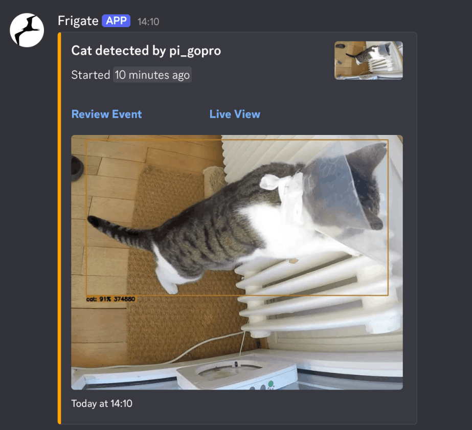

# Frigate Discord Notify
Inspired by [Frigate-Notify](https://github.com/0x2142/frigate-notify), but with a focus on a nicer discord notification and simple code. Catches **MQTT** (**required!**) events and fetches important information like detection information and snapshots, then sends a summary to a discord webhook as an embed.

As of now, direct customization of the sent embed through a config file is not possible, but this will likely be added in the future. For now you'll have to edit the code yourself.

## Showcase

### Embed Features
- **Title**: *object_name* detected by *camera_name*
- **Description**: Start time of the event (not the same as the time the embed was sent!) as a relative time discord timestamp
- **Review Event**: Link to the event in frigate
- **Live View**: Link to the live camera view in frigate that triggered the detection
- **Thumbnail** (small): Full size snapshot of the camera view
- **Image** (large): Cropped snapshot with detection box
- **Footer**: Timestamp of when embed was sent

## Installation
It is recommended to run this project as a docker container. Following are the instructions to do so:

#### Clone repository
    
`git clone https://github.com/freshefisch/frigate-discord-notify.git`
    
`cd frigate-discord-notify`

#### Rename and edit config.yml

`mv example-config.yml config.yml`

Replace the [example config](./example-config.yml) options with your own.

`nano config.yml`

#### Build docker image

`docker build -t frigate-discord-notify .`

#### Start container

`docker compose up -d`

#### Watch the logs for errors or success

`docker compose logs -f`

(To exit, press ctrl+c)

## Further Notes
- Pull requests welcome!
- If you ran into a problem, feel free to open an issue.

## Docker crash-course
If you've never used docker or it's been a while, here's the most important things you need to know:

### General commands

- `docker ps -a`: View all running containers
- `docker logs -f frigate-discord-notify`: Show logs and keep watching the output for new logs. Press `ctrl+c` to exit.

### While in the project directory

- `docker compose up -d`: Start the container
- `docker compose down`: Stop the container and remove it
- `docker compose restart`: Restart the container
- `docker compose logs -f`: Show logs and keep watching the output for new logs. Press `ctrl+c` to exit.
- `docker compose up -d --build` Build AND start container (after making changes to the `Dockerfile`)
